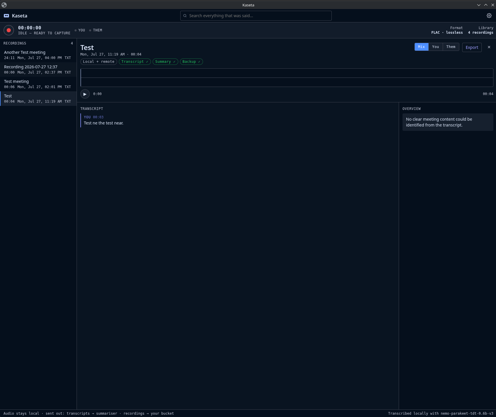
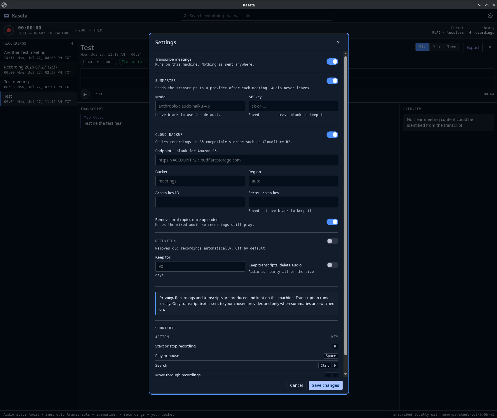

# Kaseta

A Linux meeting recorder that captures both sides of a conversation, transcribes
it on your own machine, and summarises it — without a browser extension and
without a bot joining your call. Nothing leaves the computer unless you switch
on summaries or cloud backup, and both are off until you do.

> Working name. Alpha: it works, and it has not been through many hands yet.



A recording, its transcript attributed line by line, and the summary drawn from
it. The chips along the top say what has happened to it and what has not.

## What it does

Records a meeting and, if you want, transcribes and summarises it. Start and
stop from the window or a keyboard shortcut; whatever you switched on appears on
its own.

Records your microphone and your system playback as **two separate tracks**.
That separation is the design's centre of gravity: everything on the microphone
track was said by you, everything on the playback track was said by the far end,
so **every line of the transcript already knows who said it** — no diarization,
no speaker model. It also means the two sides can be re-mixed, re-transcribed,
or diarized later without re-recording.

Works with anything that makes sound — Zoom, Meet, Teams, a native desktop app,
a browser tab — because it captures at the audio-server level rather than
hooking a specific application.

Optionally copies recordings to S3-compatible storage — Cloudflare R2,
Backblaze, MinIO — and expires old ones on a policy you set.

## Webhook

A finished recording can be handed to a URL of your choosing,
a task console, which reads the transcript and extracts the work in it. Off
until you switch it on, in **Settings**: an address, a token, and when to send —
as soon as the transcript is ready, after the summary too, or only when you
press **Send** on a recording.

Put the client at the front of the meeting title — `Acme: weekly sync`, or
`Acme - Website: redesign` — and it is filed there. Anything it cannot place
confidently waits to be filed by hand rather than being guessed at.

The token is an *intake* credential: it can deposit recordings and nothing else.
It cannot read a task, change one, or see any other client's work, which is the
right shape for something living on a laptop.

Only the transcript and the summary are sent. The audio never is.

## What leaves your machine

Nothing, until you switch something on. Each of these is a separate switch in
**Settings**.

| | Where it runs | Default |
|---|---|---|
| Recording | This machine | — |
| Transcription | This machine, in a local model | On |
| Summaries | Sends **transcript text** to a provider you choose | **Off** |
| Cloud backup | Sends audio, transcripts and summaries to your bucket | **Off** |
| Webhook | Sends **transcript text** to your own task console | **Off** |

Three of these send data off the machine, and they send different things.
**Summaries** send transcript text to a provider you choose. **Cloud backup**
sends everything — audio included — to storage you control. **Webhook** sends
transcript text to a console you run, which turns it into tasks. None happens
unless you switch it on.

For summaries, **only that switch decides**. Supplying an API key through the
environment does not turn them on: a control something else can quietly overrule
is not a control.

When summaries are on, requests decline any provider that retains what it is
sent. Open-weight models are served by many companies at once and a router would
otherwise pick between them per request, which makes "who has this transcript"
unanswerable.

Credentials live in `~/.config/kaseta/` — in `settings.json` when saved through
the interface, readable only by you, or in `env` if you would rather set them
there. Deliberately **not** in the data directory: that is what cloud backup
uploads, and a key does not belong in a bucket.

## Design constraints

**Memory.** A daemon holds the recording and the job pipeline; the interface is
a static page it serves, so closing the interface leaves no process resident.
Transcription runs in a child process that exits when the job finishes, making
its steady-state cost zero.

**Storage is addressed, not pathed.** Every byte is written through a
`BlobKey` — an opaque object key — never a filesystem path. The local directory
layout and an S3/R2 bucket layout are byte-identical, so moving between them is
a copy rather than a translation.

**Derived work lives beside what it came from.** Transcripts, summaries and a
title you typed are written as objects under the recording's own prefix, not
only into the index. The index is rebuildable from storage — delete the database
and it comes back — which is only true if everything worth keeping is in
storage. It is also what makes a backup a backup: a bucket holding audio and
nothing made from it would mean transcribing every meeting again.

**Timing is measured, not assumed.** A microphone and a sink monitor run on
independent hardware clocks and drift apart over a long meeting. Every chunk
records the canonical clock (`CLOCK_BOOTTIME`, which unlike `CLOCK_MONOTONIC`
keeps counting across suspend) at its first and last sample, so alignment is
computed from measured time. Drift stays correctable rather than baked in.

**Crashes cost one chunk.** Audio is sealed into short immutable chunks as it is
captured. A daemon killed mid-recording loses at most the chunk in flight, and
jobs orphaned by the crash are swept back onto the queue at startup.

**Devices can come and go.** Unplugging a headset mid-meeting reattaches capture
rather than ending that track. The gap is recorded as a discontinuity and
padded, so everything afterwards keeps its true position on the timeline.

**Backup does not wait on anything.** It is queued when a recording is sealed,
not behind transcription — a recording whose transcription failed is the one
most worth having a copy of. Whatever arrives later brings the recording round
for another pass.

**A stage that does nothing says so.** Switching summaries off does not make the
pipeline report a summary; it reports a skip, with the reason, and offers to run
it once you change your mind.

## Requirements

- Linux with **PipeWire** (any current Arch, Fedora, or Ubuntu 22.10+)
- **Rust** toolchain, a **C compiler**, and **`clang`**
- **Python 3.10+** with `venv`, for the transcription worker

Capture needs a live PipeWire session, so this cannot run on a headless server.
`kasetad doctor` detects that and says so rather than failing halfway into a
recording. The crates still build and the tests still pass there, so a headless
box is fine for development — just not for capture.

**`clang` is not optional.** The `pipewire-sys` crate generates its bindings with
bindgen, which loads `libclang` at build time. Without it the build fails partway
through the dependency tree with an error that does not mention clang.

### Arch / EndeavourOS

```bash
sudo pacman -S --needed rustup clang pkgconf pipewire python base-devel
rustup default stable
```

Arch ships C headers inside the main package rather than a separate `-dev` one,
so `pipewire` covers both the runtime and the headers.

### Debian / Ubuntu

```bash
sudo apt install -y libpipewire-0.3-dev libclang-dev pkg-config build-essential \
                    python3 python3-venv
curl --proto '=https' --tlsv1.2 -sSf https://sh.rustup.rs | sh -s -- -y
```

### Fedora

```bash
sudo dnf install -y pipewire-devel clang-devel pkgconf-pkg-config python3
curl --proto '=https' --tlsv1.2 -sSf https://sh.rustup.rs | sh -s -- -y
```

## Install

```bash
git clone https://github.com/agonk/kaseta.git
cd kaseta
./install.sh
```

That builds Kaseta, installs it under `~/.local`, creates the transcription
worker's virtual environment, and enables the recorder as a user service so it
starts with your session. **Kaseta** then appears in your launcher as an
ordinary application. Nothing runs as root and nothing is written outside your
home directory.

> **Keep the checkout.** The transcription worker's virtual environment lives in
> `worker/.venv` inside this directory, and its path is recorded in
> `~/.config/kaseta/env`. Moving or deleting the checkout breaks transcription
> until you run `./install.sh` again from wherever it ended up. Recordings are
> unaffected — they live in `~/.local/share/kaseta/`.

Re-running `./install.sh` is how you upgrade. It rebuilds, reinstalls, restarts
the service, and rebuilds the worker environment if the Python it was built
against has gone — which a rolling distribution does on a point-release upgrade.

Recording can also be started without opening the window. Bind
`kaseta-tray toggle` to a key in your desktop's shortcut settings, or use the
**Kaseta — Start or stop recording** entry in your launcher.

### Configuring it

Everything is set from the application — there is no configuration file to edit
by hand.



Each switch governs one thing that would otherwise happen without being asked.
Transcription runs locally and is on; summaries and cloud backup are off until
you turn them on, because both send something off the machine.

### What it installs

| | |
|---|---|
| `~/.local/bin/kasetad` | the recorder |
| `~/.local/bin/kaseta-open` | opens the window |
| `~/.local/bin/kaseta-tray` | start/stop from a shortcut |
| `~/.local/share/applications/kaseta.desktop` | launcher entry |
| `~/.local/share/applications/kaseta-record.desktop` | start/stop entry |
| `~/.local/share/icons/hicolor/scalable/apps/kaseta.svg` | icon |
| `~/.local/share/icons/hicolor/scalable/apps/kaseta-symbolic.svg` | symbolic icon |
| `~/.config/systemd/user/kaseta.service` | starts it with your session |
| `~/.config/kaseta/` | config directory; `settings.json` appears here, mode 0600, once you save settings |
| `~/.config/kaseta/env` | environment for the service |
| `~/.local/share/kaseta/` | recordings, transcripts, database |
| `worker/.venv/` | in this checkout — see the note above |

### Uninstall

```bash
systemctl --user disable --now kaseta.service
rm -f ~/.local/bin/kasetad ~/.local/bin/kaseta-open ~/.local/bin/kaseta-tray \
      ~/.local/share/applications/kaseta.desktop \
      ~/.local/share/applications/kaseta-record.desktop \
      ~/.local/share/icons/hicolor/scalable/apps/kaseta*.svg \
      ~/.config/systemd/user/kaseta.service
rm -rf ~/.config/kaseta
```

Recordings in `~/.local/share/kaseta/` are left alone; delete that directory too
if you want them gone. The worker's virtual environment lives in this checkout,
so removing the checkout removes it.

## Command line

Everything the application does is also available directly, which is useful for
diagnosing a machine that cannot record.

```bash
kasetad doctor        # can this machine record?
kasetad devices       # what can it record from?
kasetad record 60     # record both sides for 60 seconds
kasetad transcribe    # transcribe the most recent recording
kasetad export        # write mixed and per-track audio files
kasetad serve         # run the daemon and its interface
cargo test            # no audio hardware needed
```

`doctor` reports whether both a microphone and a playback monitor are present —
the two devices a meeting recording needs — and explains what is missing if not.

`record` writes FLAC chunks and a manifest under `./data` (override with
`KASETA_DATA`), then reports per-track chunk counts, duration, and **measured
clock drift**. Drift beyond ±20 ms means a merged audio export would need
resampling; transcripts are unaffected either way.

Use headphones when testing. On speakers the far end bleeds back into the
microphone track, which degrades the local-versus-remote attribution the
transcript depends on.

### Environment

| Variable | Default | Purpose |
|---|---|---|
| `KASETA_DATA` | `./data` | Where recordings are written |
| `KASETA_LOG` | `kasetad=info` | Log filter, e.g. `kasetad=debug` |
| `KASETA_PORT` | `7777` | Port the interface is served on |
| `KASETA_WORKER_PYTHON` | `worker/.venv/bin/python` | Interpreter with the transcription worker |
| `KASETA_OPENROUTER_KEY` | — | Key for summaries; a key alone does not switch them on |
| `KASETA_OPENROUTER_MODEL` | `anthropic/claude-haiku-4.5` | Model used for summaries |

Most of these are better set in **Settings**. Installed setups read the
environment from `~/.config/kaseta/env`, which wins over anything saved in
Settings, so a key exported for a one-off run is not silently overridden.

## Layout

```
crates/
  kaseta-contracts/   Types crossing a process or storage boundary. No I/O.
  kasetad/            The daemon: capture, storage, jobs, local API, interface.
worker/               Transcription worker. Short-lived, spawned per job.
packaging/            Desktop entries, user service, icon.
install.sh            Build, install, enable.
```

## Not built yet

Roughly in the order they would be worth doing.

- **Import an existing file.** Drop in an audio or video file and have it
  transcribed and summarised. Needs `ffmpeg`, and comes with an honest caveat:
  an imported file is a single track, so the two-track attribution does not
  apply and every line would be marked unattributed.
- **An index at the bucket root**, mapping object prefixes to titles and dates,
  so a bucket is navigable without opening every folder.
- **A packaged install** — an AUR package, so upgrading does not mean keeping a
  checkout around.
- **Reading audio back from the bucket**, so removing local copies can reclaim
  everything rather than keeping the mixed export for playback.
- **Video capture.**
- **Windows and macOS.** Most of the stack above capture is not inherently
  Linux-specific, but it has never been built elsewhere, so treat that as
  untested. Each platform would need its own two-track capture backend — WASAPI
  loopback on Windows, ScreenCaptureKit or a virtual device on macOS.

Nothing here is promised, and there is no schedule.

## Legal

**Recording other people is regulated, and the rules differ by country and by
state.** Some places require every participant to consent; some require only
one; some distinguish private conversations from business calls, or add
obligations when a recording contains personal data. This software does not know
where you are, who is on the call, or what applies to you, and it makes no
attempt to enforce any of it.

**Complying is your responsibility, not the author's.** You are responsible for
obtaining whatever consent is required, for telling participants they are being
recorded where that is required, and for how you store, transmit and dispose of
what you capture — including anything sent to a summary provider or uploaded to
your own cloud storage.

This is a plain description of how the software behaves, not legal advice. If
you are unsure whether you may record a particular conversation, ask someone
qualified before you do.

The licence disclaims warranties and limits liability to the extent the law
allows. Nothing in this file changes that.

## Licence

Apache License 2.0. See [LICENSE](LICENSE).

Permissive: use it, change it, ship it in something commercial, keep your
changes private. It comes with **no warranty of any kind**, and the author is
not liable for anything arising from its use.
